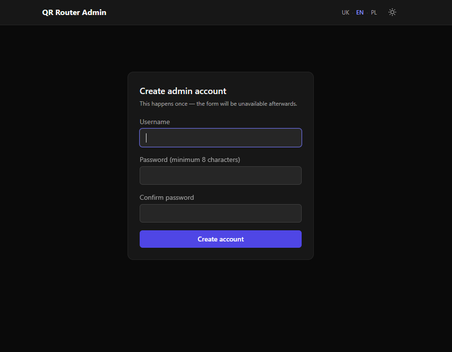
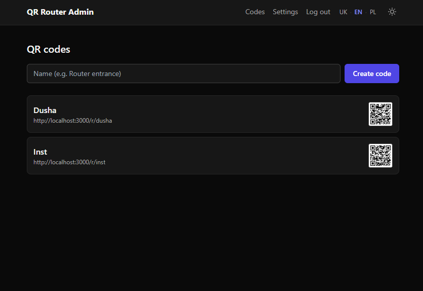
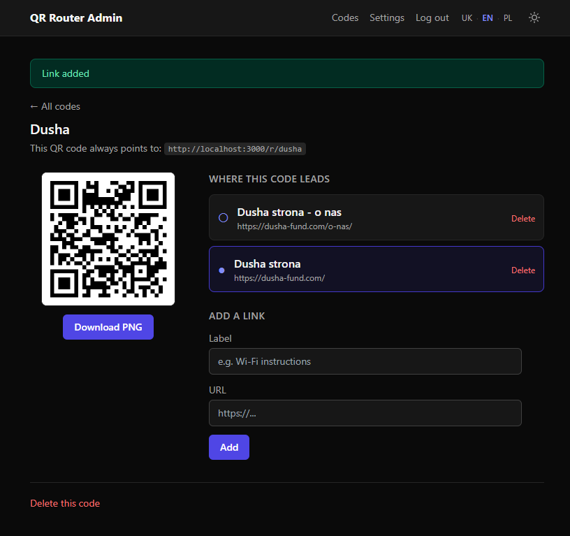
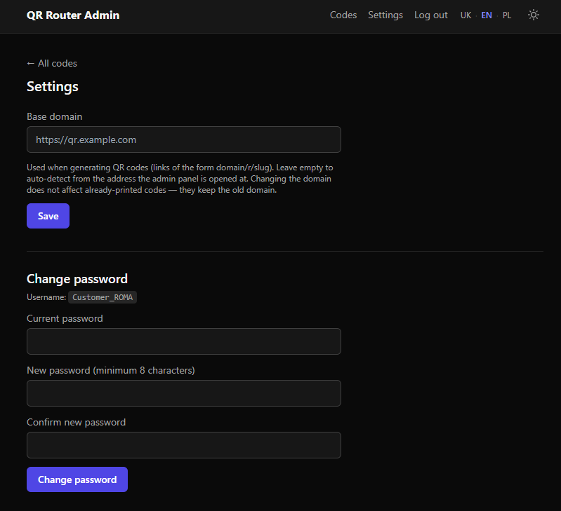

[🇬🇧 English](README.md) · 🇺🇦 **Українська** · [🇵🇱 Polski](README.pl.md)

# QR Router Admin

Один статичний QR-код, який завжди веде на `<домен>/r/<slug>`. Куди саме він
перенаправляє далі — вирішує адмін через панель керування, обираючи активне
посилання зі списку. Сам QR-код при цьому не змінюється.

## Скріншоти

<table>
  <tr>
    <td width="50%">
      
      <br><b>Перше налаштування</b> — створення акаунту адміна
    </td>
    <td width="50%">
      
      <br><b>Дашборд</b> — список QR-кодів
    </td>
  </tr>
  <tr>
    <td width="50%">
      
      <br><b>Сторінка коду</b> — QR-код і перемикання активного посилання
    </td>
    <td width="50%">
      
      <br><b>Налаштування</b> — базовий домен і пароль
    </td>
  </tr>
</table>

## Стек

Node.js + Express + SQLite (файл, без окремого контейнера БД) + EJS.
Стилі — Tailwind CSS через CDN (без build-кроку), темна тема за замовчуванням
з перемикачем на світлу (зберігається в `localStorage` браузера), адаптивна
верстка. Все працює в Docker-контейнерах, без сторонніх хмарних сервісів і
без оренди чогось додаткового.

## Розгортання (по IP / без домену)

### Що потрібно

Docker з плагіном Compose (перевірити: `docker compose version`). Якщо на
сервері (Ubuntu/Debian) Docker ще не встановлено:
```
curl -fsSL https://get.docker.com | sh
sudo usermod -aG docker $USER   # потім перелогінитись
```

### Кроки

1. Клонувати репозиторій:
   ```
   git clone https://github.com/RomanFisher/qr-router-admin.git
   cd qr-router-admin
   ```
2. Створити конфіг:
   ```
   cp .env.example .env
   ```
3. Запустити:
   ```
   docker compose up -d --build
   ```
4. Відкрити `http://localhost:3000` (локально) або `http://<IP-сервера>:3000`
   (на віддаленому сервері) — з'явиться форма створення акаунту адміна
   (логін + пароль, мінімум 8 символів). Ніякого дефолтного пароля в коді
   немає: доки акаунт не створено через цю форму, увійти в адмінку
   неможливо.

Далі: створити код → додати одне чи кілька посилань → обрати активне →
завантажити QR (PNG) кнопкою і роздрукувати.

### Якщо це віддалений сервер (VPS)

- Дозволити порт у фаєрволі, якщо він увімкнений:
  ```
  sudo ufw allow 3000/tcp
  ```
- У хмарних провайдерів (AWS/DigitalOcean/Hetzner тощо) додатково треба
  відкрити порт у Security Group / Firewall rules у веб-панелі провайдера —
  самого `ufw` на сервері часто недостатньо.
- Для реального домену й HTTPS без відкритого порту 3000 назовні — дивись
  розділ нижче.

## Зміна порту, якщо 3000 зайнятий

За замовчуванням застосунок доступний на порту 3000. Якщо він вже зайнятий
іншим процесом на машині, вкажи в `.env`:
```
HOST_PORT=8080
```
і перезапусти:
```
docker compose up -d --build
```
Далі відкривай за новим портом: `http://localhost:8080`. Усередині
контейнера порт лишається фіксованим (3000) — `HOST_PORT` міняє лише
зовнішній, видимий ззовні порт, тому міняти більше нічого не треба.

## Запуск з власним доменом і HTTPS (Caddy)

Якщо є домен, DNS A-запис якого вказує на IP сервера, і відкриті порти 80/443:

1. У `.env` вказати:
   ```
   DOMAIN=qr.мійдомен.com
   ```
2. Запустити разом з Caddy (окремий compose-файл, HTTPS-сертифікат Let's
   Encrypt отримується автоматично):
   ```
   docker compose -f docker-compose.https.yml up -d --build
   ```
3. Відкрити `https://qr.мійдомен.com` — далі так само, форма створення
   адміна при першому заході.

Порт 3000 у цьому режимі назовні не публікується — весь трафік іде через
Caddy на 443/80.

## Мови

Інтерфейс доступний трьома мовами: українська, англійська, польська
(`src/locales/*.json`). Мова визначається так:

1. Якщо є cookie `lang` (людина вже обирала мову перемикачем зверху) — береться вона.
2. Інакше — береться мова браузера (заголовок `Accept-Language`).
3. Якщо мова браузера не входить у список підтримуваних — за замовчуванням англійська.

Перемикач мов (UK · EN · PL) є вгорі на кожній сторінці, включно з екраном
входу і першого налаштування — працює без входу в акаунт.

## Тести

Автотести (`tests/`) прогонюють увесь цикл: майстер налаштування, логін,
захист адмін-розділу, створення коду, додавання/перемикання посилань,
редірект, зміну пароля, видалення; окремий тест на конкурентність (сотні
одночасних сканувань під час паралельного перемикання активного посилання);
і окремий тест на мультимовність (визначення мови браузера, фолбек на
англійську, перемикач, захист від відкритого редіректу через параметр
`redirect`). Використовують вбудований `node --test` і ізольовану in-memory
базу — на реальні дані (`./data/app.db`) не впливають.

Без Docker (потрібен один раз `npm install`):
```
npm install
npm test
```

Або в контейнері, без встановлення Node.js на хості:
```
docker compose run --rm app npm test
```

## Відновлення доступу (забутий пароль)

Пошти в проєкті немає і не планується — відновлення через сервер, до якого
адмін і так має доступ (SSH/Docker), напряму встановлює новий пароль у базі:

```
docker compose exec app npm run reset-admin -- admin новийНадійнийПароль
```

(для HTTPS-запуску: `docker compose -f docker-compose.https.yml exec app ...`)

Це перезаписує акаунт — попередній пароль не потрібен.

## Дані

SQLite-файл лежить у `./data/app.db` на хості (том Docker) — переживає
перезапуск і перезбірку контейнера. Бекап = скопіювати цей файл. Разом з ним
там же зберігається автоматично згенерований секрет сесій
(`./data/.session_secret`) — не видаляти, інакше всі сесії розлогиняться.

## Продакшн-нотатки

- Логін захищений простим rate-limit (10 спроб / 15 хв на IP).
- Зміна `BASE_DOMAIN` у розділі "Налаштування" не змінює вже роздруковані
  QR-коди — фізичний код кодує домен, який був активний у момент генерації
  PNG.
- За Caddy автоматичне визначення домену (для генерації нових QR) працює
  коректно з коробки, бо Caddy передає правильні заголовки — окремо нічого
  налаштовувати не треба.
